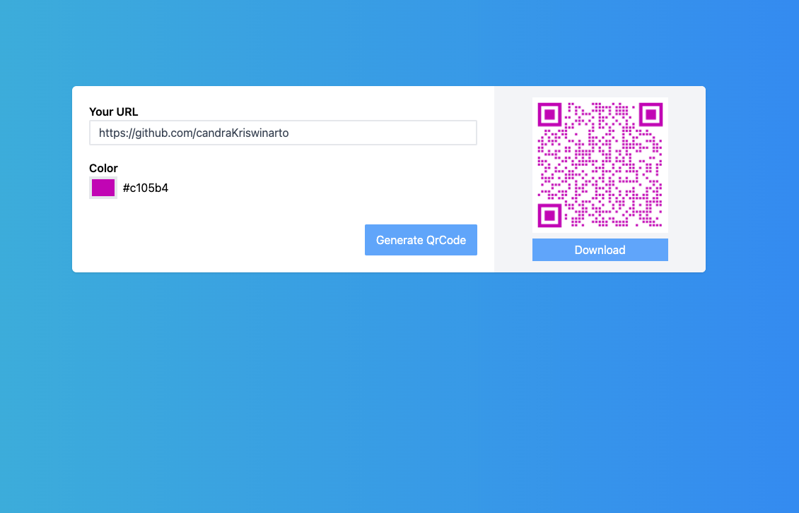

This project was bootstrapped with [Create React App](https://github.com/facebook/create-react-app).

## Available Scripts

In the project directory, you can run:

### `npm i`

Instal All dependencies in this project

### `npm start`

Runs the app in the development mode. 
Open [http://localhost:3000](http://localhost:3000) to view it in the browser.

### Link

Reactjs: https://reactjs.org/docs/create-a-new-react-app.html
QrCode Tiger: https://www.qrcode-tiger.com/
QrCode Tiger Doc: https://www.qrcode-tiger.com/api-documentation
QrCode Tiger Stoplight: https://qrtiger.stoplight.io/docs/qrtiger-api/b3A6NzgwMTkwNg-create-static-qr-code
TailwindCSS: https://tailwindcss.com/
React Color: https://casesandberg.github.io/react-color/#examples
File Saver: https://www.npmjs.com/package/file-saver
